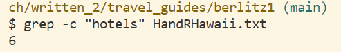
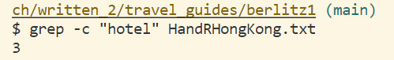
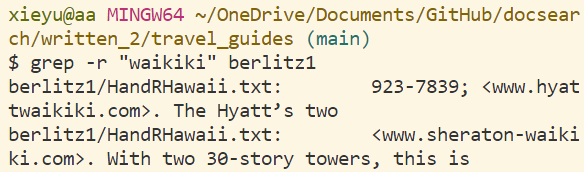
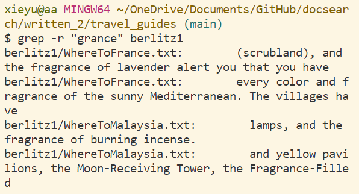
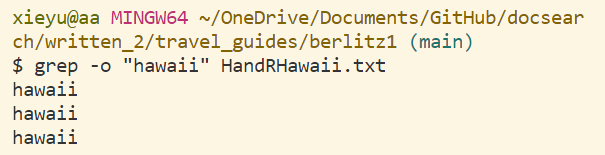
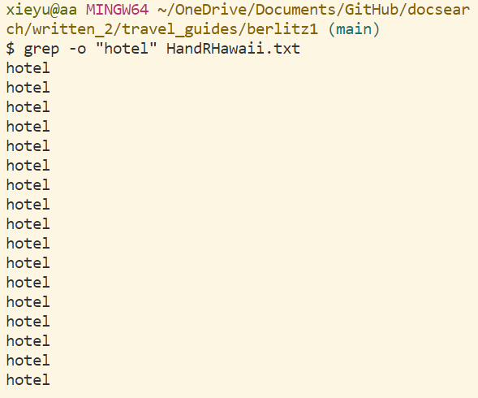
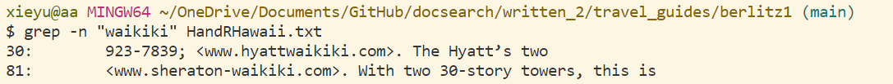
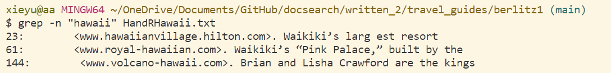

# Lab Report 3

## Researching Commands
The 4 interesting command-lines options I chose from grep:
* grep -c
* grep -r
* grep -o
* grep -n

### grep-c:
 -c, --count               print only a count of matching lines per FILE
 
 
 
 

grep -c is use to count how many times of the given word appear in one file. And it will dispay the number of times. This comand-line can use to compare how many times we use the given
words from different files.

### grep -r
 -r, --recursive           like --directories=recurse
 
 
 
 
 
 grep -r is recursive through the directories. And it will output where is the given words we want to find, include some of the sentence between that words and also the files where find
 the given word.
 
 ### grep -o
  -o, --only-matching       show only the part of a line matching PATTERN
  
  
  
  
  grep -o is dispays the same times of the given words. The different between grep -o and grep -c is that grep -c will count the number of the given words, and output number only. But grep-o
  will find every given words and display the words as times as count,
  
 ### grep -n
  -n, --line-number         print line number with output lines
  
  
  
 
 grep -n is to find the given words, display the lines and line number. I think it is the most useful command-line, since we can easily find out where is the words we want. And grep -n is similar
 to grep -r, but the different is that the grep -r find the given word though the directory, and grep -n find the given word though the file and will also display the line number and some of the 
 sentences.

 
 The definition of four grep are from grep --help;
 
